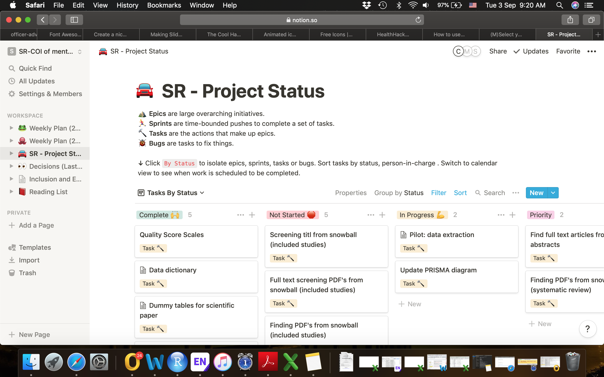
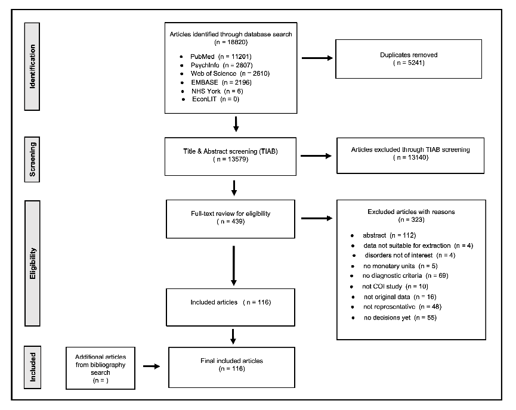
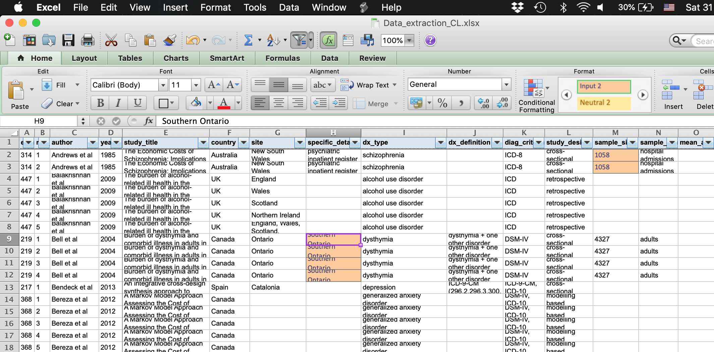
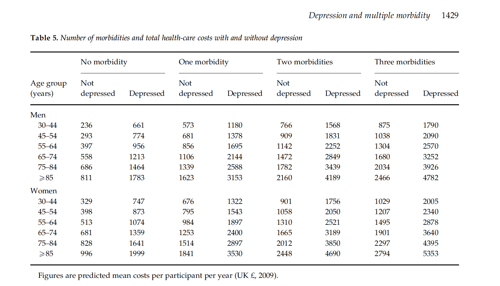

```{r setup, include=FALSE}
options(htmltools.dir.version = FALSE)
options(knitr.table.output = 'html')
library(knitr)
knitr::opts_chunk$set(echo = TRUE)
#devtools::install_github("yihui/xaringan")
#devtools::install_github('emitanaka/anicon')

setwd("/Users/carmenlim/Dropbox/RMD")
library(DT)
library(ggplot2)
library(ggmap)
library(maps)
library(RColorBrewer)
library(mapdata)
library(plotly)
library(knitr)
library(kableExtra)
library(rmarkdown) 

 
#Dataset
map <- read.csv("data/map.csv")
database <- read.csv("data/database.csv")
number_exc <- read.csv("data/number_exc.csv")
```

# Notion 

<br>

```{r r44, echo = FALSE, out.width = '76%', out.height= '80%'}

```

Link to Notion available [here.](https://www.notion.so/srburden/Weekly-Plan-2-9-c87d6daae2ca44019cc33e7b9a6eb6e0)

---

# Review question

<br>

- To identify COI studies for mental disorders and to explore the distribution of costs between disorders. 

- Included studies will be assessed for methodology, period of study, geographical locations, subgroups and study quality. 

- The results of the review will not be suitable for pooling via meta-analytic techniques, we will explore methods to display the data graphically.

 
---

# Study Protocol

```{r r1, echo = FALSE, out.width = '80%', out.height= '110%'}

```

Link to the study protocol available [here.](https://www.crd.york.ac.uk/prospero/display_record.php?RecordID=127783)
---

 
# Inclusion criteria

<br>
- COI studies focusing on mental disorders.

- Study must be from a societal or health care perspective.

- Study must report estimates on a national or subnational level in monetary terms with standard errors or other related metrics for uncertainty. 

- Studies must report the different costs categories and data sources used.

- Studies between 1980 till 2019.

---
 

# Exclusion criteria

<br>

- abstract, commentary, letter to the editor

- not original data (i.e. review, systematic reviews and editorials)

- no published diagnostic criteria

- population not representative

- no cost quoted in the results section

- PDF could not be located

---
 

# Dataset

<br>

```{r d1, echo = FALSE,  tidy = FALSE}
DT::datatable(
  map[,c(1:3,6,9)], 
  colnames = c('Author' = 'author',
  'Year' = 'year_published',
  'Title' = 'title',
  'Country' = 'country',
  'Disorder' = 'disorder'), 
  rownames = FALSE, 
  options = list(pageLength = 3),
  fillContainer = FALSE
  )
```

---

# Number of studies from each database

<br>
<br>

```{r r100, echo = FALSE, out.width = '100%', out.height = '55%'}
database$Database <- factor(database$Database, levels = c("Pubmed", "PsychInfo", "Web of Science", "Embase","NHS York",  "EconLIT" ))

p<- ggplot(database, aes(x = Database, y = number)) +
  geom_bar(stat = "identity") + 
  coord_flip() +
  theme_bw() + 
  ylab(" ") +
  xlab(" ")
mytext=paste("No of hits = ", database$number, "\n", sep = "")  
style( ggplotly(p), text=mytext, hoverinfo = "text" )

```

---

# Reasons for exclusion

<br>
<br>

```{r r2, echo = FALSE, out.width = '100%', out.height = '60%'}

p<- ggplot(number_exc, aes(x = reorder(reason,-number), y = number)) +
  geom_bar(stat = "identity") + 
  coord_flip() +
  theme_bw() + 
  ylab(" ") +
  xlab(" ")
mytext=paste("No = ", number_exc$number, "\n", sep = "")  
style( ggplotly(p), text=mytext, hoverinfo = "text" )

```


---

 

# Progress as of 3/9/2019

<br>
<br>
<br>


```{r r3, echo = FALSE, layout="l-body-outset"}
Item<- c("Number of full-text review", 
         "Number of final decisions", 
         "Number of pending decision", 
         "Number of pending PDFs", 
         "Number of included studies", 
         "Number of extracted", 
         "Number extracted (incl. qual scores)")
Number<- c(439,
           386,
           2,
           53,
           116,
           29,
           23)
c<- data.frame(Item,Number)
#paged_table(c)  
 
c %>% 
  knitr::kable(format = "html")
```


---

 
# PRISMA diagram


```{r r4, echo = FALSE, out.width = '76%', out.height= '80%'}

```


---
 
# Data dictionary

.pull-left[
```{r r5,echo = FALSE, highlight.output=c(1)}
Variable<- c( "endnote_id", 
          "rate_id", 
          "author", 
          "year", 
          "study_title",
          "country",
          "dx_type",
          "dx_definition",
          "diag_criteria"
          )
Definition<- c( "endnote ID",
                "estimate ID",
                "first author",
                "publication year",
                "study title",
                "study location",
                "type of disorder",
                "disorder definition",
                "diagnostic criteria")
d<- data.frame(Variable,Definition)
 
d %>% 
  knitr::kable(format = "html")
```
]

.pull-right[
```{r r6,echo = FALSE, highlight.output=c(1)}
Variable<- c( "study_design", 
          "sample_size", 
          "age_start/age_end", 
          "females_prop",
          "data_source",
          "perspective",
          "def_perspective"
          )
Definition<- c( "prospective, retropective",
                "number used in analysis",
                "age range",
                "% females",
                "data source used to derive cost est",
                "perspective (e.g. societal)",
                "definition of perspective")
e<- data.frame(Variable,Definition)
 
e %>% 
  knitr::kable(format = "html")
```
]


---

# Data dictionary

<br>

```{r r8,echo = FALSE, highlight.output=c(1)}
Variable<- c( "pricing_year", 
          "discounting_rate", 
          "study_period", 
          "cost_approach", 
          "page/table number",
          "cost_broad_type",
          "cost_specific_type",
          "cost_method",
          "cost_prodloss_method"
          )
Definition<- c( "pricing year",
                "applicable to the incidence approach",
                "study duration (start/end)",
                "principal approaches to estimate cost (prevalence/incidence)",
                "location of the cost estimate",
                "broad label for cost estimate (e.g. direct health cost)",
                "specific label for cost estimate (e.g. GP, absenteeism)",
                "method used to estimate $ (e.g bottom-up)",
                "productivity loss method")
f<- data.frame(Variable,Definition)
 
f %>% 
  knitr::kable(format = "html")
```
---


# Data dictionary

<br>

```{r r9,echo = FALSE, highlight.output=c(1)}
Variable<- c( "cost_adjustment", 
          "cost_type", 
          "num_cases", 
          "currency", 
          "cost",
          "cost_scale",
          "cost_unit",
          "sd_cost",
          "lower_ci/upper_ci"
          )
Definition<- c( "unadjusted or adjusted cost",
                "is this incremental/disorder/control cost?",
                "number of cases reflecting the cost estimate",
                "type of currency",
                "cost estimate ($)",
                "million, thousands etc",
                "total cost or mean per patient cost etc",
                "std deviation of the cost estimate",
                "confidence intervals for the cost estimate")
f<- data.frame(Variable,Definition)
 
f %>% 
  knitr::kable(format = "html")
```
---

# Question  

<br>

- Do we need (epidemiological) study design variable? 

---

# Data extraction

<br>

```{r r10, echo = FALSE, out.width = '100%', out.height= '240%'}

```

---

# Quality Scores

<br>

```{r r11,echo = FALSE, highlight.output=c(1)}
Variable<- c( "Study objective", 
          "Diagnostic criteria", 
          "Non-diseased comparison group ", 
          "Currency", 
          "Pricing year",
          "Perspective")
Definition<- c( "The objectives of the study were well-defined",
                "The diagnostic criteria (ICD, DSM etc) that were used to identify eligible patients were reported. ",
                "If the study included a control group (without disease of interest) in order to calculate excess/incremental costs, this group must be clearly described. ",
                "The currency in which the costs were calculated was reported",
                "All costs were valued at the price level of a stated base year (and inflated if necessary) ",
                "The perspective of the study (societal, health system etc.) was reported")
d<- data.frame(Variable,Definition)
 
d %>% 
  knitr::kable(format = "html")
```

---


# Quality Scores

<br>

```{r r12,echo = FALSE, highlight.output=c(1)}
Variable<- c( "Data source", 
          "Costs valuation", 
          "Discounting", 
          "Costing methods"
          )
Definition<- c( "The source(s) of information on epidemiological data, health care utilization and costs was (were) reported",
                "If data on health care utilization was collected, the source of unit costs was reported, in case cost data were used these reflected actual charges",
                "If data from one patient were collected from or estimated for a period longer than one year future costs were discounted and the discount rate was given",
                "The costing methods were described in detail and were appropriate regarding the specific characteristics of cost data (e.g. prevalence based, incidence based, modelling approach)")
d<- data.frame(Variable,Definition)
 
d %>% 
  knitr::kable(format = "html")
```

---


# Quality Scores

<br>

```{r r13,echo = FALSE, highlight.output=c(1)}
Variable<- c("Missing data & imputation method",
             "Sensitivity analysis", 
          "Sample size", 
          "Demographics", 
          "Cost measure"
          )
Definition<- c( "The proportion of missing data was reported and the imputation method was described",
                "Relevant parameters were varied in univariate and/or probabilistic sensitivity analyses in order to test the robustness of the results for example different unit costs, different assumptions for missing data (completely at random, at random and not at random)",
                "The sample size used to estimate cost was reported",
                "The characteristics of the sample were described, at least age and gender were reported",
                "The units of the reported measures were clearly stated (etc. mean annual costs, mean total costs and incremental costs)")
d<- data.frame(Variable,Definition)
 
d %>% 
  knitr::kable(format = "html")
```

---


# Quality Scores

<br>

```{r r14,echo = FALSE, highlight.output=c(1)}
Variable<- c("Uncertainty estimates",
            "Results discussed with respect to other
          studies",
          "Limitations",
          "Conclusions appropriate regarding
         uncertainty in results"
         )
Definition<- c("Some measurements of uncertainty surrounding the cost estimates are reported (e.g. standard deviations (errors) or uncertainty intervals)",
                "The results were discussed in relation to other studies on the same topic, if any",
               "The limitations in particular to the calculation of costs were discussed in detail",
               "The conclusions allowed for the uncertainty inherent to the results"
               )
d<- data.frame(Variable,Definition)
 
d %>% 
  knitr::kable(format = "html")
```

---

# Global COI Studies


```{r fig2, echo = FALSE, warning = FALSE, message = FALSE, out.height = '80%', out.width = '70%'}

require(viridis)
m <- list(
  l = 50,
  r = 50,
  b = 80,
  t = 80,
  pad = 4
)

#geo styling
g <- list(
  scope = 'world',
  projection = list(type = 'Mercator'),
  showframe = FALSE,
  showland = TRUE,
  landcolor = toRGB("gray95"),
  subunitcolor = toRGB("gray85"),
  countrycolor = toRGB("gray85"),
  countrywidth = 0.9,
  subunitwidth = 0.5,
  showcoastlines = F
)
p <- plot_geo(map, lat = ~lat, lon = ~lon) %>%
  add_markers(
      text = ~paste('</br>Author: ', author, '</br> Country: ', country,'</br> Journal: ', journal, '</br> Year: ', year_published, '</br> Disorder: ', disorder), hoverinfo = "text",symbol = I("circle"),size = I(9), color = ~disorder, colors = viridis::magma(5)
  ) %>%   
  layout(
    title = ' ',
    autosize = F, width = 800, height = 500, margin = m,
    geo = g ,
    showlegend = TRUE
  )
  
p

```

 
---

# Distribution of COI Studies
 

```{r fig3, echo = FALSE, warning = FALSE, message = FALSE, out.height = '70%', out.width = '80%'}
 #geom_point(aes(x = population, y = reorder(city, population)))
#scale_fill_brewer(palette=3) +
  #scale_color_brewer(palette=3) +
a<- ggplot(map) +
  geom_point(aes(x = year_published, y= reorder(country, year_published))) + theme_bw() + 
  ggtitle(" ") + 
  ylab(" ") +
  xlab(" ") +
  scale_color_brewer(palette=3) +
  theme(plot.title = element_text(hjust = 0.5))
  mytext=paste("Author = ", map$author, "\n", "Year = ", map$year_published, "\n" , "Country = ", map$country, "\n", "Disorder = ", map$disorder,  sep="")    
style(ggplotly(a), text=mytext, hoverinfo = "text" ) %>%   
  layout(
    autosize = F, width = 800, height = 500
    )

```

 
---


# To do list

<br>

.pull-left[

]
.pull-right[
- Snowball titles from `included studies` 
- Merge the above with `snowball from systematic reviews`
- Remove `duplicates`
- Screen PDFs
- Data extraction
]
---


# General questions

<br>

- Abstracts found during full-text search
- Foreign language papers
- Deadline for `cannot locate PDFs`


---

# Data extraction questions

<br>

- Some papers do not report year for the costing (etc. Bell et al). Which assumption should be made?
- Need specific classification of data sources: 1) administrative registers, surveys, national/regional budgets, a mixture?

---

# Data extraction questions
.pull-left[
```{r echo = FALSE, out.width = '100%', out.height= '140%'}

```
]
.pull-right[
```{r echo = FALSE, out.width = '100%', out.height= '140%'}
knitr::include_graphics("figs/Bon et al 2013.png")
```
]


